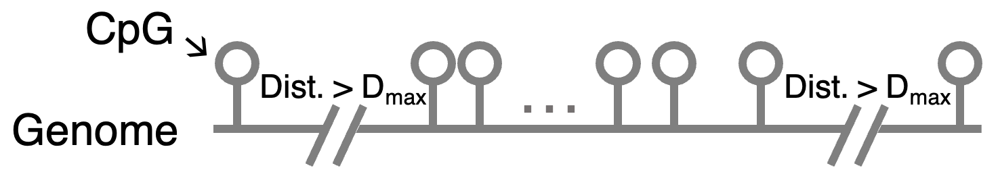
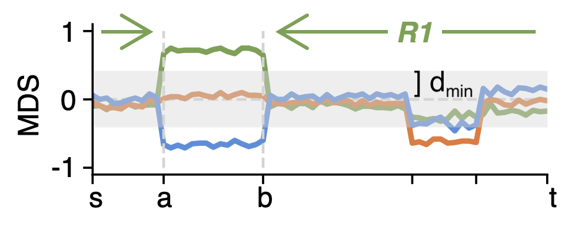
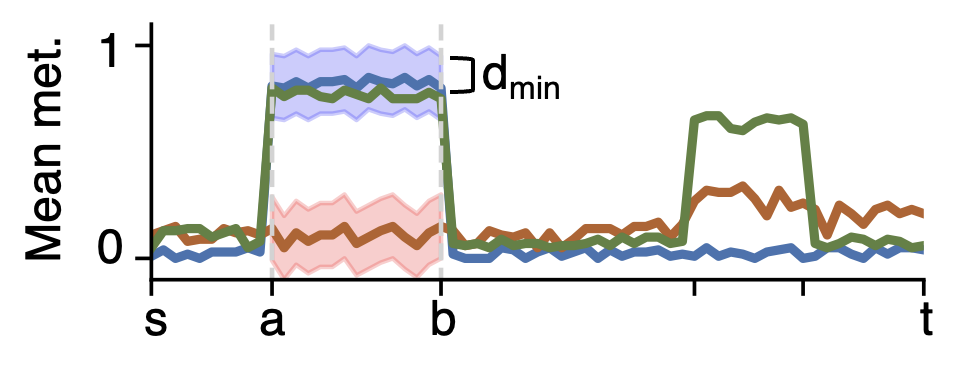
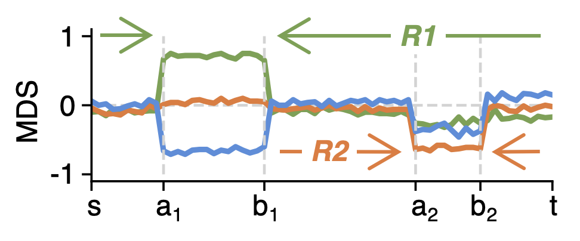

# Details for DMR calling

---

## Presegmentation

{:style="text-align:center;"}
{: width="350" }

The first step of DMR calling is presegmentation - cutting the genome based on the distances between CpGs. A segment starts with a CpG and stops at a CpG with a distance to the next CpG greater than the max distance allowed $$D_{max}$$, which is from ```-M, --maxdist```. Each segment will be further segmented based on methylation data in a thread.


## Segmentation

{:style="text-align:center;"}
{: width="350" }

After presegmentation, each segment will be further segmented based on pairwise methylation difference. To be computational effient, filters are applied to skip segments:

- Number of CpGs is lower than $$m_{min}$$ from ```-m, --minCpGs```.
- Number of CpGs with absolute mean difference greater than $$d_{min}$$ from ```-d, --minMethDiff``` (or ```-D, --minMethDiffHigh``` when calling DMRs without groups) is lower than $$r_{min}$$ from ```-r, --minDMR```.

Segments passing the filters will be segmented by finding the $$Z_{max}(s,t,a,b,G,G')$$.

## Clustering

{:style="text-align:center;"}
{: width="350" }

After segmentation, the breakpoint positions $$a,b$$ and the pair of groups/samples $$G',H'$$ will be used to cluster other groups. 
A group/sample will be clustered with $$G'$$ or $$H'$$ according to the methylation-distance. 
If the group/sample has a ratio of CpGs with minimal difference $$d_{min}$$ to $$G' or H'$$ smaller than the maximum ratio 
$$u_{min}$$ defined from ```-u, --clusteringRatio```, this group/sample will be clustered with $$G' or H'$$. 
Otherwise, this group/sample will be marked as intermediate. 
If the clustering is unambiguous, this group/sample will also be marked as intermediate. 

## Recursion

{:style="text-align:center;"}
{: width="350" }

After the first breakpoint pair $$a,b$$ is found, metilene3 will continue to further segment the sub-regions $$[s,a_1]$$, $$[a_1,b_1]$$ and $$[b_1,t]$$, until the criteria of termination are met:

- Number of CpGs in a sub-region is lower than $$m_{min}$$ from ```-m, --minCpGs```.
- No p-values of all sub-regions is found more significant than the p-value of the region to be further segmented.

<script src="https://cdn.mathjax.org/mathjax/latest/MathJax.js?config=TeX-AMS-MML_HTMLorMML" type="text/javascript"></script>