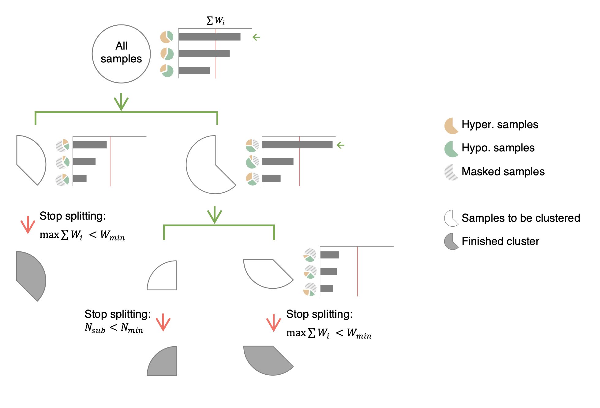

# Details for DMTree

---

Based on DMRs we can build a tree for clustering samples, termed DMTree.

{:style="text-align:center;"}
{: width="800" }

Start with all samples, the patterns of DMRs will be ranked by the sum of DMR weight $$\sum{W_i}$$, where $$W_i$$ is the absolute mean difference for DMR $$i$$. Samples will be splitted into groups based on the pattern with highest $$\sum{W_i}$$, until all possible pattern met the following termination criteria:
- The number samples in the subgroup $$N_{sub}$$ is smaller than $$N_{min}$$ from ```-n, --minNSamples```.
- The sum of DMR weight $$\sum{W_i}$$ is smaller than $$W_{min}$$ from ```-w, --minSumDMRs```.


<script src="https://cdn.mathjax.org/mathjax/latest/MathJax.js?config=TeX-AMS-MML_HTMLorMML" type="text/javascript"></script>