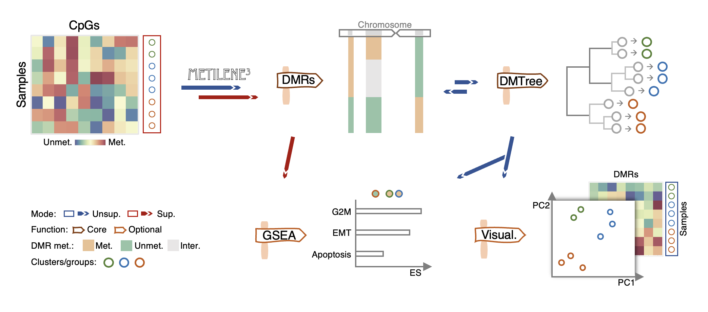

# Introduction

---

Metilene3 is a software to identify differentially methylated regions (DMRs) and perform clustering based on DMRs among multiple samples/groups.

# License
The software is published under the GNU GPL v2.0 license.