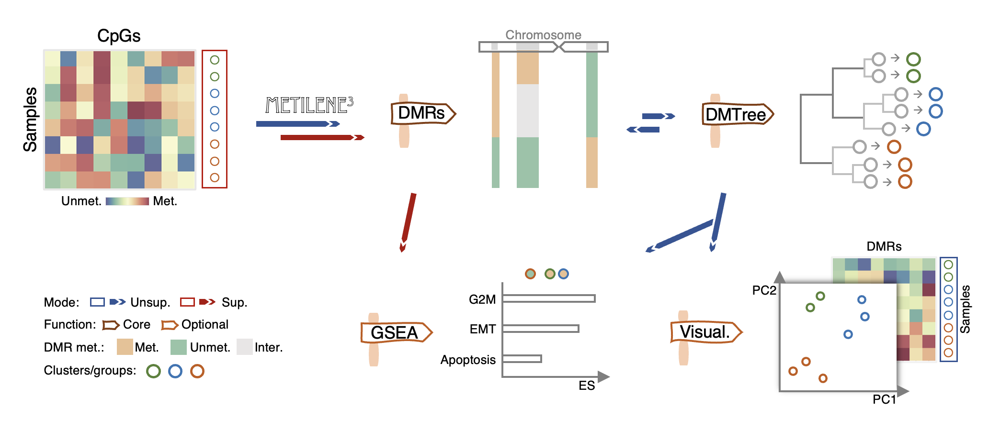

# Introduction

---

Metilene3 is a software to identify differentially methylated regions (DMRs) and perform clustering based on DMRs among multiple samples/groups.

# Citation
Zhu Z, Bernhart SH, Jühling F, Kretzmer H, Hoffmann S. metilene3: identifying DMRs across multiple conditions with auto-classification. Nat Commun. 2026 Jul 4;17(1):5848.
[doi: 10.1038/s41467-026-74931-y.](https://doi.org/10.1038/s41467-026-74931-y)

# License
The software is published under the GNU GPL v2.0 license.
